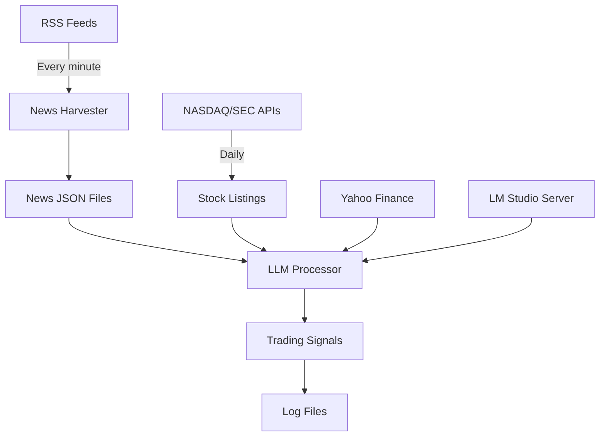

# IBKR-BOT 🤖📈

An intelligent trading signal generator that harvests financial news, analyzes it with LLM, and generates actionable trading signals with confidence scores.

## ⚠️ Disclaimer

**This software is for educational and research purposes only. It is NOT financial advice. Always perform your own due diligence before making any trading decisions. The authors assume no responsibility for financial losses incurred through the use of this software.**

## 🎯 Features

- **Real-time News Harvesting**: Collects news from 60+ RSS feeds every minute
- **LLM-Powered Analysis**: Uses local LLM (via LM Studio) to analyze news impact on stocks
- **Smart Scheduling**: Dynamically adjusts processing time based on news volume
- **Trading Signals**: Generates BUY/SELL signals with confidence scores (0-100%)
- **Price Enrichment**: Fetches real-time price data from Yahoo Finance
- **Comprehensive Logging**: Tracks all decisions in multiple specialized log files
- **Market-Aware**: Updates stock listings daily before market open

## 🚀 Quick Start

### Prerequisites

- Python 3.9+ (uses `zoneinfo`)
- [LM Studio](https://lmstudio.ai/) installed and running
- Internet connection for news and price data

### Installation

1. Clone the repository:
```bash
git clone https://github.com/yourusername/IBKR-BOT.git
cd IBKR-BOT
```

2. Create virtual environment:
```bash
python3 -m venv .venv
source .venv/bin/activate  # On Windows: .venv\Scripts\activate
```

3. Install dependencies:
```bash
pip install lmstudio requests feedparser readability-lxml beautifulsoup4 lxml
```

4. Set environment variables:
```bash
# Required: Set your email for SEC API access
export SEC_USER_AGENT="YourBot/1.0 (your-email@example.com)"

# Optional: Set LM Studio server if not on localhost
export LMSTUDIO_SERVER_HOST="192.168.1.100:1234"
```

5. Start LM Studio and load a model

6. Run the bot:
```bash
python main.py
```

## 📊 System Architecture



## 🔧 Configuration

All settings are centralized in `args.py`:

### Key Settings

| Setting | Default | Description |
|---------|---------|-------------|
| `HIGH_CONFIDENCE_THRESHOLD` | 80% | Minimum confidence for high-confidence trades |
| `REVISED_CONFIDENCE_THRESHOLD` | 70% | Minimum confidence after enrichment |
| `LLM_TIMEOUT` | 120s | Maximum time for LLM processing |
| `NEWS_CYCLE_BUDGET` | 20s | Time allocated for news harvesting |
| `ENABLE_SMART_SCHEDULING` | True | Adaptive time allocation |

### Command Line Options

```bash
# Run with custom settings
python main.py --llm-host 192.168.1.100:1234 --high-confidence 75

# Clean all data and logs
python main.py -c

# Disable smart scheduling
python main.py --no-smart-scheduling

# Run in verbose mode
python main.py --verbose
```

## 📁 Project Structure

```
IBKR-BOT/
├── main.py                 # Main orchestrator
├── args.py                 # Centralized configuration
├── news_harvester.py       # Single-cycle news fetcher
├── news_feed.py           # Continuous RSS harvester
├── llm.py                 # LLM decision engine
├── news_checker.py        # Smart scheduling optimizer
├── fetch_us_listings.py   # Stock listings updater
├── data/
│   ├── news/              # Minute-bucketed news (YYMMDDHHMM.json)
│   ├── result/            # LLM processing results
│   └── us-stock-listing/  # Daily stock listings
└── logs/
    ├── detailed.log              # Complete system log
    ├── simple.log                # Summary log
    ├── high_confidence_trades.log    # Trades ≥80% confidence
    └── revised_confidence_trades.log # Trades ≥70% after enrichment
```

## 🧠 Smart Scheduling

The system dynamically adjusts time allocation based on news volume:

| News Volume | Harvest Time | LLM Time | Strategy |
|------------|--------------|----------|----------|
| 0 items | 5s | 50s | Quick check, maximum analysis |
| 1-3 items | 10s | 45s | Light harvest, extended analysis |
| 4-10 items | 15s | 40s | Balanced allocation |
| 11-20 items | 20s | 35s | Standard harvest |
| 20+ items | 25s | 30s | Maximum harvest |

## 📈 Trading Signals

Each signal includes:
- **Ticker**: Stock symbol
- **Action**: BUY or SELL
- **Confidence**: Initial confidence (0-100%)
- **Revised Confidence**: After enrichment with additional data
- **Expected Price**: Target price prediction
- **Horizon**: Timeframe in hours
- **Reasoning**: Detailed explanation

Example signal (JSON):
```json
{
  "ticker": "AAPL",
  "action": "BUY",
  "confidence": 85,
  "revised_confidence": 92,
  "expected_price": 185.50,
  "horizon_hours": 24,
  "reason": "Strong iPhone sales data with positive analyst upgrades...",
  "news_title": "Apple Reports Record Q4 Revenue",
  "news_link": "https://...",
  "news_time": "2024-01-15T14:30:00Z"
}
```

## 📰 News Sources

The bot monitors 60+ RSS feeds including:
- Bloomberg
- Wall Street Journal
- Financial Times
- MarketWatch
- Reuters
- CNBC
- Yahoo Finance
- SEC Filings
- Federal Reserve
- Company press releases

## 🔍 Monitoring

### View Real-time Activity
```bash
# Watch main activity
tail -f logs/simple.log

# Monitor high-confidence trades
tail -f logs/high_confidence_trades.log

# Check for errors
grep ERROR logs/detailed.log | tail -20
```

### Extract Trading Signals
```bash
# Today's high-confidence trades
grep "$(date +%Y-%m-%d)" logs/high_confidence_trades.log | jq '.'

# Count trades by action
grep "$(date +%Y-%m-%d)" logs/high_confidence_trades.log | jq -r '.action' | sort | uniq -c
```

## 🐛 Troubleshooting

### LM Studio Connection Issues
```bash
# Test connection
curl http://localhost:1234/health

# Check if model is loaded
curl http://localhost:1234/v1/models
```

### Missing Stock Listings
```bash
# Manually update listings
python fetch_us_listings.py --force
```

### News Harvesting Issues
```bash
# Test harvester standalone
python news_harvester.py -v

# Check seen database
sqlite3 data/news/.seen.db "SELECT COUNT(*) FROM seen;"
```

## 🚢 Production Deployment

### Using systemd (Linux)

1. Create service file `/etc/systemd/system/ibkr-bot.service`:
```ini
[Unit]
Description=IBKR Trading Bot
After=network.target

[Service]
Type=simple
User=youruser
WorkingDirectory=/path/to/IBKR-BOT
Environment="SEC_USER_AGENT=YourBot/1.0 (your@email.com)"
ExecStart=/path/to/venv/bin/python /path/to/IBKR-BOT/main.py
Restart=always

[Install]
WantedBy=multi-user.target
```

2. Enable and start:
```bash
sudo systemctl enable ibkr-bot
sudo systemctl start ibkr-bot
```

### Using Docker

```dockerfile
FROM python:3.9-slim
WORKDIR /app
COPY requirements.txt .
RUN pip install -r requirements.txt
COPY . .
CMD ["python", "main.py"]
```

## 📊 Performance

- **News Processing**: ~1000 articles/hour
- **LLM Analysis**: 10-50 decisions/minute
- **Memory Usage**: ~200MB
- **CPU Usage**: 5-15% (single core)
- **Network**: ~10MB/hour

## 🤝 Contributing

Contributions are welcome! Please:
1. Fork the repository
2. Create a feature branch
3. Commit your changes
4. Push to the branch
5. Open a Pull Request

## 📝 License

MIT License - see [LICENSE](LICENSE) file for details

## 🙏 Acknowledgments

- [LM Studio](https://lmstudio.ai/) for local LLM inference
- [Yahoo Finance](https://finance.yahoo.com/) for price data
- All news providers for RSS feeds
- SEC for company data APIs

## 📮 Contact

For questions or support, please open an issue on GitHub.

---

**Remember**: This is a research tool for educational purposes. Always verify signals before trading. Past performance does not guarantee future results.